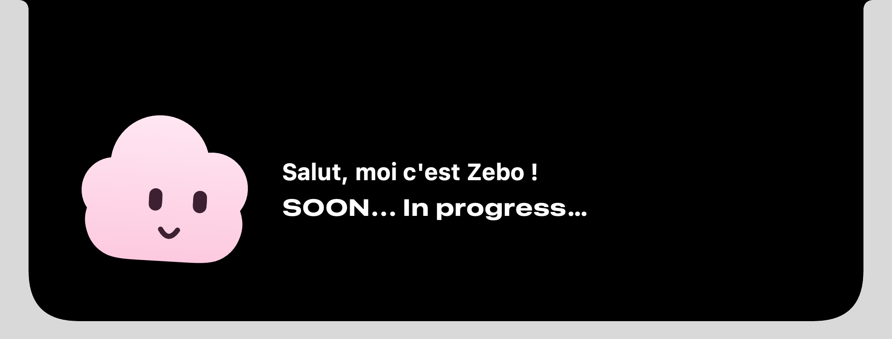

# Zebo

Un petit nuage rose qui vit dans la notch du Mac. Il dort quand on ne s'occupe pas de lui, se réveille quand la souris passe, parle quand on clique dessus… et tombe dans les pommes si on insiste trop.

| Notch fermée : Zebo dort, l'heure à droite | Notch ouverte : Zebo est réveillé |
| --- | --- |
|  |  |

## Ce que fait Zebo

- **Il se configure.** Au premier lancement, la notch ouverte propose « Configurer Zebo ». Au clic, la notch se détache : sa forme glisse jusqu'au centre de l'écran et devient une fenêtre d'application. Zebo s'y présente, puis on règle en quelques étapes animées :
  1. **Ton prénom** : Zebo t'appellera comme ça (« Enchanté, … ! »).
  2. **Ton langage préféré**, parmi une douzaine.
  3. **Tes éditeurs de code** (un ou plusieurs) : VS Code, Cursor, Xcode, les IDE JetBrains… Au clic, Zebo retrouve tout seul où chacun est installé (ou on le lui indique), pour pouvoir les lancer plus tard.
  4. **Sa notch** : ce qu'affiche l'aile droite (l'heure, la date, tes commits du jour, ton langage) et la sieste, avec un aperçu en direct.
  5. **Le récapitulatif**, puis « C'est parti » : la fenêtre se rétracte dans la notch.

  Le temps de la configuration, Zebo a une icône dans le Dock. Pour la refaire : clic droit sur la notch, **Reconfigurer Zebo…**
- **Il dort.** Notch fermée, il est allongé dans son lit dans l'aile gauche, avec un bonnet de nuit, sous sa couette ; des « z » s'échappent de sa tête.
- **Il t'informe.** L'aile droite de la notch fermée affiche les widgets choisis : l'heure, la date, tes commits du jour, ton langage préféré. S'il y en a plusieurs, ils défilent toutes les 5, 10 ou 30 secondes. Les commits du jour sont comptés avec Git dans les dépôts de ton dossier de projets (deviné, `~/Documents/Dev` par exemple), d'après ton adresse `git config user.email`, toutes les 5 minutes.
- **Il se réveille.** Quand la souris passe sur la notch, elle s'ouvre : le lit s'efface, Zebo se redresse, suit la souris des yeux, cligne des yeux et se balance doucement.
- **Il parle.** Un clic sur lui affiche une réplique (avec ton prénom) dans une bulle en forme de nuage, lettre par lettre, reliée à lui par des points qui apparaissent un à un. Pendant qu'il parle, il prend un air pensif 🤔 (sourcils levés, moue, regard en l'air). Un nouveau message ne peut partir qu'au bout de 4 s.
- **Il s'évanouit.** Trois clics en moins de 1,5 s l'assomment : yeux en spirale, étoiles autour de la tête, il gigote… puis il est catapulté hors de la notch, traverse l'écran en tournoyant et revient avec un « pop » quelques secondes plus tard.

Pour quitter Zebo : clic droit sur la notch, puis **Quitter Zebo**. En dehors de sa configuration, il n'a pas d'icône dans le Dock.

## Installation

Prérequis : macOS 14 ou plus récent, Xcode 16 ou plus récent (Swift 6).

```sh
git clone https://github.com/SticksOnTheBeach/zebo.git
cd zebo
make run
```

`make run` compile le projet, assemble `build/Zebo.app` et le lance (en remplaçant une instance déjà ouverte). Aucune permission n'est demandée : suivre la souris n'en nécessite pas.

Sur un écran sans encoche, Zebo dessine une fausse notch au centre de la barre des menus.

## Commandes

```sh
make run      # compile, assemble Zebo.app et le lance
make build    # compile seulement
make test     # tests unitaires
make lint     # vérifie le style sans rien modifier
make format   # formate le code
make help     # liste les commandes
```

`make test` compile dans `~/Library/Caches/zebo-build` : si le dépôt est dans un dossier synchronisé par iCloud (comme `~/Documents`), iCloud ajoute des attributs Finder aux bundles compilés et la signature du bundle de tests échoue. Un `swift test` direct marche si le dépôt est ailleurs.

## Architecture

Le paquet est découpé en trois modules, chacun ne dépendant que des précédents :

| Module | Rôle | Dépend de |
| --- | --- | --- |
| `ZeboCore` | Logique pure et état observable : règles des clics, trajectoire de chute, répliques, modèle de la notch, widgets, préférences, éditeurs et commits, parcours et assistant de configuration. Ni SwiftUI ni AppKit. | — |
| `ZeboUI` | Vues SwiftUI : le personnage, la notch, l'heure, la bulle de dialogue, le lit, la chute, la configuration. | `ZeboCore` |
| `Zebo` | L'app : point d'entrée AppKit, fenêtres, suivi de la souris, détection de l'écran à encoche. | `ZeboCore`, `ZeboUI` |

```
Sources/
├── ZeboCore/
│   ├── Behavior/   ZeboBehavior (réactions aux clics), PokeTracker (règles)
│   ├── Notch/      NotchModel (géométrie et état de la notch), ZeboPlacement
│   ├── Code/       IDE (catalogue d'éditeurs), Language, CommitActivity (commits du jour), ProjectsFolder
│   ├── Physics/    Flight (trajectoire de la chute)
│   ├── Preferences/ ZeboPreferences, ZeboSettings (préférences et leur mémorisation)
│   ├── Setup/      SetupFlow (notch → fenêtre → notch), SetupWizard (étapes), SetupStore
│   ├── Widgets/    NotchWidget, NotchWidgetRotation (qui s'affiche quand)
│   └── Speech/     ZeboSpeech (machine à écrire), SpeechLineSource et PersonalizedLines (répliques), ZeboSpeaking
├── ZeboUI/
│   ├── Character/  ZeboCharacter (dessin), AnimatedZebo (vie), ZeboMood, Shapes/
│   ├── Notch/      NotchView, NotchShape, NotchWidgetsView (widgets qui défilent), NotchClock
│   ├── Speech/     SpeechBubbleView, CloudBubbleShape, CappedWidth
│   ├── Sleep/      InBed (le lit), SleepingZs (les « z »)
│   ├── Setup/      SetupView (fenêtre), Steps/ (une vue par étape), SetupTransitionView et
│   │               NotchToWindowShape (animation), NotchPreview, SetupPrompt (bouton de la notch)
│   ├── Components/ ZeboButtonStyle, PageDots, .appearing (apparition décalée)
│   ├── Fall/       FallingZeboView
│   └── ZeboPalette
└── Zebo/
    ├── App/        ZeboApp (point d'entrée), AppDelegate, MainMenu
    ├── Windows/    NotchController, OverlayPanel, SetupWindowController
    ├── Code/       WorkspaceApplicationLocator (retrouve les éditeurs), GitCommitCounter (compte les commits)
    ├── Input/      MouseMonitor
    └── Extensions/ NSScreen+Notch
Tests/
└── ZeboCoreTests/
```

L'app utilise trois fenêtres transparentes posées au-dessus de la barre des menus : la notch elle-même, la bulle de dialogue juste en dessous, et une fenêtre plein écran affichée seulement pendant la chute de Zebo. La configuration ajoute une fenêtre plein écran le temps de l'animation, puis une vraie fenêtre d'application ; Zebo passe alors en app « normale » (icône dans le Dock, menu), et redevient discret quand elle se ferme.

Quelques choix :

- **Les règles sont pures.** `PokeTracker` et `Flight` reçoivent la date et le générateur aléatoire en paramètres, ce qui les rend testables.
- **Les dépendances passent par des protocoles.** `ZeboBehavior` ne connaît que `ZeboSpeaking` et `ZeboPlacement`, pas les classes concrètes ; les tests utilisent de faux objets.
- **Les répliques sont interchangeables.** `ZeboSpeech` reçoit un `SpeechLineSource` : pour brancher une IA, il suffit d'écrire une nouvelle source.
- **Les animations restent dans les vues.** Les modèles changent l'état, les vues décident comment l'animer (`.animation(_:value:)`).
- **Une humeur à la fois.** `ZeboMood` (calme, pensif, sonné, endormi) décide de l'expression de Zebo, sans booléens qui pourraient se contredire.
- **Le personnage se dessine sur une grille de 100 × 100.** Il s'adapte à n'importe quelle taille, de la notch fermée à la notch ouverte.

## Tests

Les tests couvrent `ZeboCore` avec [Swift Testing](https://developer.apple.com/documentation/testing) : règles des clics, trajectoire et éjection, répliques, parole (machine à écrire, silence), comportement face aux clics jusqu'à l'éjection, géométrie de la notch, widgets et leur rotation, préférences (et reprise des anciennes), éditeurs, commits du jour, et configuration (parcours, assistant, mémorisation).

Les vues de `ZeboUI` n'ont pas de logique isolée : elles se vérifient à l'œil, en lançant l'app. Pour une capture ou un aperçu sans animations d'apparition : `.environment(\.showsFinalAppearance, true)`.

Les tests qui dépendent du temps n'attendent pas une durée fixe : `waitUntil` (dans `Tests/ZeboCoreTests/Support/`) vérifie la condition toutes les 10 ms jusqu'à un délai maximal.

## Conventions

- Code (types, fonctions, variables) en anglais ; commentaires, messages de commit et tests en français.
- Style vérifié par [swift-format](https://github.com/swiftlang/swift-format) (`.swift-format` : 4 espaces, 120 colonnes). Lancer `make format` avant de committer.
- Un fichier par type. Les formes SwiftUI se terminent par `Shape`.
- Petits commits, un par étape logique, au format [Conventional Commits](https://www.conventionalcommits.org/fr/) avec un scope : `feat(behavior): …`, `tweak(fall): …`, `refactor(speech): …`.
- Tests avec Swift Testing, une suite par type, chaque test décrit en une phrase.

## La suite

- Un onglet de raccourcis dans la notch, pour lancer les éditeurs choisis pendant la configuration.
- Une fois configuré, la notch ouverte annonce « SOON… In progress… » : la place à droite de Zebo est réservée à une vraie discussion avec lui.

Pour repartir de zéro (configuration et préférences) : `defaults delete com.sticksonthebeach.zebo`.
