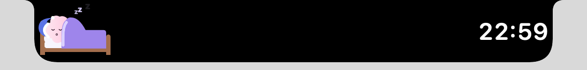
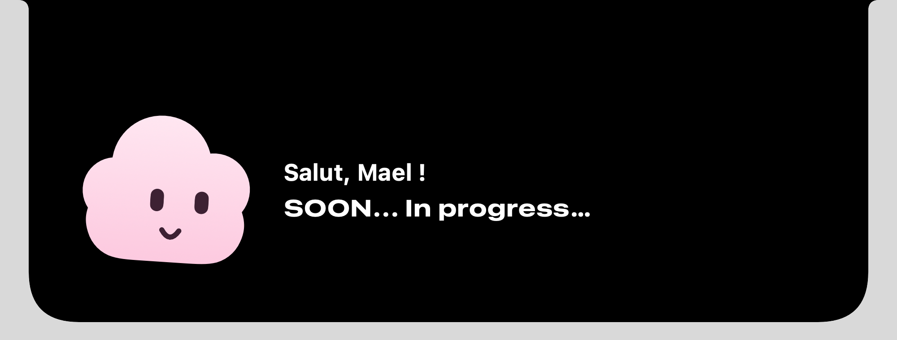

# Zebo

A little pink cloud that lives in your Mac's notch. It sleeps when you leave it alone, wakes up when your mouse comes by, talks when you click on it… and faints if you insist too much.

| Closed notch: Zebo sleeps, widgets on the right | Open notch: Zebo is awake |
| --- | --- |
|  |  |

The app's interface is in French.

## What Zebo does

- **It gets set up.** On first launch, the open notch offers "Configurer Zebo". Click it and the notch detaches: its shape glides to the center of the screen and turns into a frosted-glass window (inspired by Alcove's onboarding). Zebo introduces itself, then a few animated steps follow:
  1. **Your first name**: what Zebo will call you ("Enchanté, … !").
  2. **Your favorite language**, among a dozen, each with its real logo.
  3. **Your code editors** (one or more): VS Code, Cursor, Xcode, the JetBrains IDEs… Click one and Zebo finds where it is installed on its own (or you point to it), so it can launch it later.
  4. **Claude** (optional): an Anthropic API key, kept in the macOS Keychain, so Zebo can use Claude to find where your projects belong.
  5. **Its notch**: what the right wing shows (time, date, today's commits, your language) and whether Zebo naps, with a live preview.
  6. **A summary**, then "C'est parti": the window fades away while Zebo alone flies to the center of the screen, winks, and flips his way back into the notch.

  While being set up, Zebo has a Dock icon. To run the setup again: right-click the notch, **Reconfigurer Zebo…**
- **It helps with your projects.** The open notch has two tabs, **Accueil** and **Projets**. The Projects tab lists the projects created with Zebo (click to open one in its editor) and a **Nouveau projet** button: the notch detaches into a window where you pick the kind (Web, C, C++, Python, Rust, Java, Swift, Kotlin, Go, C#), name the project, then Zebo looks for an existing workspace for that kind in your projects folder and asks whether to use it or create a new one. Finally it creates the project (starter files, a Git repository), opens it in the editor you chose, and flips back into the notch.
- **It asks Claude where your projects belong.** With an API key, Zebo sends Claude (`claude-opus-5-5`, low effort, JSON output, server-side fallback on refusal) the names of the folders in your projects folder and their file counts per extension, never file contents, and gets back which folders are workspaces for the chosen kind, with a reason. Without a key, or if the call fails, it guesses locally from folder names and file types.
- **It sleeps.** When the notch is closed, it lies in its bed in the left wing, wearing a nightcap, under its blanket; little "z"s float away from its head.
- **It keeps you posted.** The right wing of the closed notch shows the widgets you picked: the time, the date, today's commits, your favorite language. With several of them, they take turns every 5, 10 or 30 seconds. Today's commits are counted with Git in the repositories of your projects folder (guessed, e.g. `~/Documents/Dev`), using your `git config user.email`, every 5 minutes.
- **It wakes up.** When the mouse hovers the closed notch, it grows slightly, like [Alcove](https://tryalcove.com); a click opens it: the bed fades away, Zebo stands up, follows the mouse with its eyes, blinks and sways gently. The notch closes again when the mouse leaves.
- **It talks.** Clicking on it shows a line (with your first name) in a cloud-shaped bubble, typed letter by letter, linked to Zebo by dots that pop in one by one. While talking, it looks thoughtful 🤔 (raised eyebrows, pout, eyes up). A new message can only start after 4 s.
- **It faints.** Three clicks within 1.5 s knock it out: spiral eyes, stars around its head, it wobbles… then it gets catapulted out of the notch, spins across the screen and pops back a few seconds later.

To quit Zebo: right-click the notch, then **Quitter Zebo**. Outside of setup, it has no Dock icon.

## Installation

Requirements: macOS 14 or later, Xcode 16 or later (Swift 6).

```sh
git clone https://github.com/SticksOnTheBeach/zebo.git
cd zebo
make run
```

`make run` builds the project, assembles `build/Zebo.app` and launches it (replacing a running instance). No permission is requested: following the mouse doesn't need any.

On a screen without a notch, Zebo draws a fake notch in the middle of the menu bar.

## Commands

```sh
make run      # build, assemble Zebo.app and launch it
make build    # build only
make test     # unit tests
make lint     # check the style without changing anything
make format   # format the code
make help     # list the commands
```

`make build`, `make test` and `make run` build in `~/Library/Caches/zebo-build`: when the repository lives in an iCloud-synced folder (like `~/Documents`), iCloud adds Finder attributes to built bundles and their code signing fails. A plain `swift build` / `swift test` works if the repository is elsewhere.

To start over from scratch (setup and preferences): `defaults delete com.sticksonthebeach.zebo`, or, in a debug build, right-click the notch and pick **Réinitialiser Zebo**.

## Architecture

The package is split into three modules, each depending only on the previous ones:

| Module | Role | Depends on |
| --- | --- | --- |
| `ZeboCore` | Pure logic and observable state: click rules, fall trajectory, lines, notch model, widgets, preferences, editors and commits, setup flow and wizard. No SwiftUI, no AppKit. | — |
| `ZeboUI` | SwiftUI views: the character, the notch and its widgets, the speech bubble, the bed, the fall, the setup. | `ZeboCore` |
| `Zebo` | The app: AppKit entry point, windows, mouse tracking, notched screen detection, Git and editor lookup. | `ZeboCore`, `ZeboUI` |

```
Sources/
├── ZeboCore/
│   ├── AI/          ClaudeWorkspaceAdvisor, SmartWorkspaceAdvisor (Claude, then local), HTTPTransport, APIKeyStore
│   ├── Behavior/    ZeboBehavior (reactions to clicks), PokeTracker (rules)
│   ├── Code/        IDE (editor catalog), Language, CommitActivity (today's commits), ProjectsFolder
│   ├── Notch/       NotchModel (notch geometry, tabs), ZeboPlacement, DetachedWindowFlow (notch → window → notch)
│   ├── Physics/     Flight (fall trajectory)
│   ├── Preferences/ ZeboPreferences, ZeboSettings (preferences and their storage)
│   ├── Projects/    ProjectKind, WorkspaceAdvisor (+ local), ProjectTemplate, ProjectScaffolder,
│   │                NewProjectWizard, ProjectsLibrary
│   ├── Setup/       SetupFlow, SetupWizard (steps), SetupStore
│   ├── Speech/      ZeboSpeech (typewriter), SpeechLineSource and PersonalizedLines (lines), ZeboSpeaking
│   └── Widgets/     NotchWidget, NotchWidgetRotation (what shows when)
├── ZeboUI/
│   ├── Character/   ZeboCharacter (drawing), AnimatedZebo (life), ZeboMood, Shapes/
│   ├── Components/  ZeboButtonStyle, PageDots, .appearing (staggered appearance), VisualEffectBackground,
│   │                SparkleField
│   ├── Fall/        FallingZeboView
│   ├── Notch/       NotchView, NotchShape, NotchWidgetsView (rotating widgets), NotchClock, NotchTabBar,
│   │                ProjectsTabView
│   ├── Projects/    NewProjectView (window), Steps/ (kind, name, workspace, editor)
│   ├── Resources/   Languages/ (language and project kind logos, SVG)
│   ├── Setup/       SetupView (window), SetupBackground (glass), Steps/ (one view per step), SetupTransitionView and
│   │                NotchToWindowShape (notch → window), SetupFinaleView (wink and flip back), NotchPreview,
│   │                SetupPrompt (notch button)
│   ├── Sleep/       InBed (the bed), SleepingZs (the "z"s)
│   ├── Speech/      SpeechBubbleView, CloudBubbleShape, CappedWidth
│   └── ZeboPalette
└── Zebo/
    ├── AI/          KeychainAPIKeyStore
    ├── App/         ZeboApp (entry point), AppDelegate, MainMenu, DevReset
    ├── Code/        WorkspaceApplicationLocator (finds editors), Git, GitCommitCounter (counts commits),
    │                FolderScanner (describes the projects folder), ProjectOpener
    ├── Extensions/  NSScreen+Notch
    ├── Input/       MouseMonitor
    └── Windows/     NotchController, OverlayPanel, DetachedWindowController (windows born from the notch),
                     SetupWindowController, ProjectWindowController
Tests/
└── ZeboCoreTests/
```

The app uses three transparent windows above the menu bar: the notch itself, the speech bubble right below it, and a full-screen window shown only while Zebo falls. Setup and new projects add a full-screen window for the animations, then a regular app window; Zebo then becomes a "normal" app (Dock icon, menu bar) and goes back to being discreet when the window closes.

A few design choices:

- **Rules are pure.** `PokeTracker` and `Flight` take the date and the random generator as parameters, which makes them testable.
- **Dependencies go through protocols.** `ZeboBehavior` only knows `ZeboSpeaking` and `ZeboPlacement`, not the concrete classes; tests use fakes. The same goes for `ApplicationLocator`, `CommitCounter`, `WorkspaceAdvisor`, `HTTPTransport` and `APIKeyStore`: the Claude client is tested without any network call.
- **Claude can't invent paths.** Its answer is constrained by a JSON schema, and any path it returns that wasn't in the folders sent to it is dropped.
- **Lines are swappable.** `ZeboSpeech` takes a `SpeechLineSource`: plugging in an AI only means writing a new source.
- **Animations stay in the views.** Models change state, views decide how to animate it (`.animation(_:value:)`).
- **One mood at a time.** `ZeboMood` (calm, thinking, dizzy, sleeping) drives Zebo's expression, with no booleans that could contradict each other.
- **The character is drawn on a 100 × 100 grid.** It adapts to any size, from the closed notch to the open one.
- **Old preferences keep working.** `ZeboPreferences` decodes missing settings with their defaults and migrates older formats (single editor, clock-only notch).

## Tests

Tests cover `ZeboCore` with [Swift Testing](https://developer.apple.com/documentation/testing): click rules, trajectory and ejection, lines, speech (typewriter, silence), behavior from clicks to ejection, notch geometry, widgets and their rotation, preferences (and migration of old ones), editors, today's commits, setup (flow, wizard, storage), workspace detection (local and Claude, with a fake transport), project templates and creation, the new project wizard and the projects library.

`ZeboUI` views have no isolated logic: they are checked by eye, by running the app. For a screenshot or a preview without appearance animations: `.environment(\.showsFinalAppearance, true)`.

Time-dependent tests don't wait for a fixed duration: `waitUntil` (in `Tests/ZeboCoreTests/Support/`) checks the condition every 10 ms up to a timeout.

## Conventions

- Code (types, functions, variables), commit messages and this README in English; code comments, tests and the app's interface in French.
- Style checked by [swift-format](https://github.com/swiftlang/swift-format) (`.swift-format`: 4 spaces, 120 columns). Run `make format` before committing.
- One file per type. SwiftUI shapes end with `Shape`.
- Small commits, one per logical step, following [Conventional Commits](https://www.conventionalcommits.org/) with a scope: `feat(behavior): …`, `tweak(fall): …`, `refactor(speech): …`.
- Tests with Swift Testing, one suite per type, each test described in one sentence.

## Credits

Language logos come from [Devicon](https://devicon.dev) (MIT license, see `Sources/ZeboUI/Resources/Languages/LICENSE-devicon.txt`). The Swift logo's path data was rewritten to the standard SVG arc syntax so macOS can draw it; the drawing is unchanged. Logos are trademarks of their respective owners.

## What's next

- A shortcuts tab in the notch, to launch the editors picked during setup.
- Starting a project from a template chosen by Claude, or adding an existing project to the library.
- Once set up, the open notch says "SOON… In progress…": the space next to Zebo is reserved for a real conversation with it.
